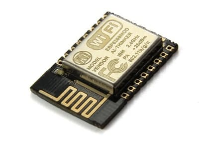
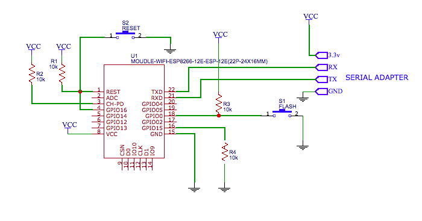
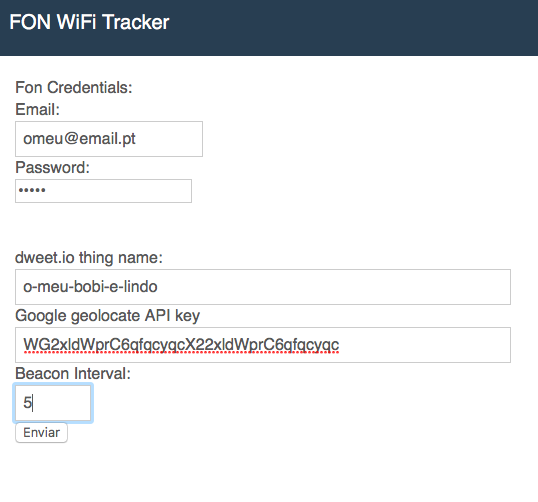
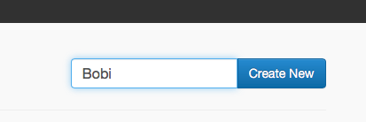
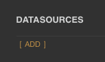
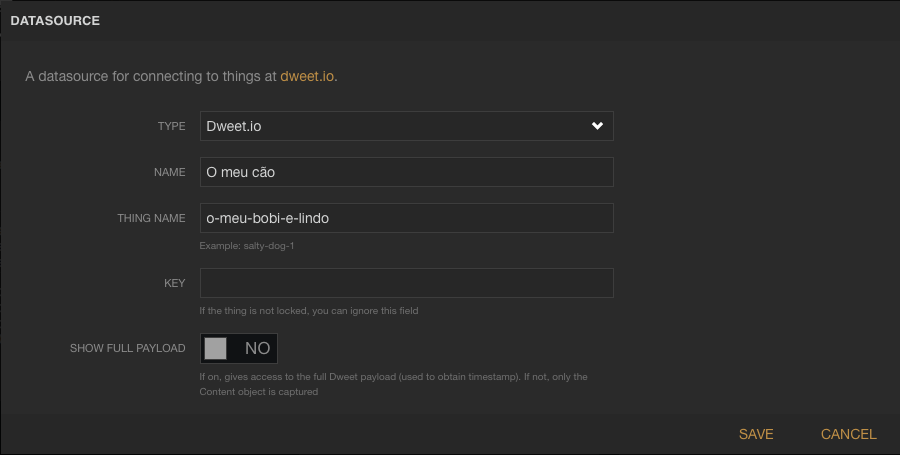
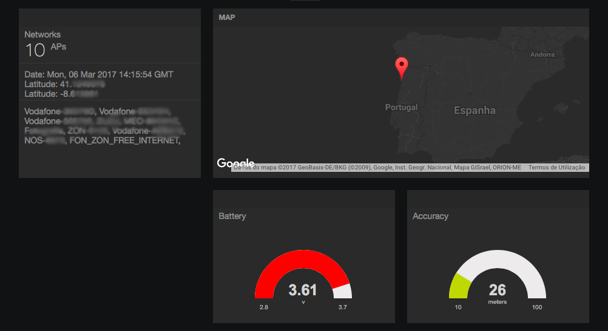

##ESP8266 Fon WiFi tracker
É um rastrador que usa um módulo WiFi (ESP8266) para se ligar às redes FON\_ZON\_FREE\_INTERNET e ter acesso à internet, geolocalizar-se por rede WiFi e enviar a localização para um dashboard online. Só funciona em Portugal.
 


###Requisitos:

- 1 conta activa da Fon
- 1 chave da GoogleAPI 
- Escolher id do seu dispositivo
- 1 conta em Freeboard.io


###Funcionamento:

Apenas com um pequeno módulo como o ESP-12E (1,80€) é possível rastrear por WiFi por ex: o seu automóvel ou o seu animal. O rastreador permite o uso de bateria poupando ao máximo possível em modo sleep. Pode controlar o intervalo de tempo entre os *beacons* sendo que maior a duração bateria quanto menos enviar. Os dados são enviados para serem exibidos um conhecido dashboard online, o freeboard.io.
Como todo o serviço gratuito terá os seus dados de rastreio partilhados online de forma anónima, o que não deve ser problema para a maior parte das pessoas. Os dados são armazenados por um dia.


###Upload do Firmware
Para flashar os módulos tradicionais como o ESP-12E terá de ter um adaptador série TTL-USB de 3.3v. Pode optar por módulos que contém já o adaptador ttl como o nodemcu, ou o Wemos, tendo em conta que irão esgotar mais rapidamente a bateria devido aos componentes extra. **O pino GPIO16 deve estar ligado ao reset** para que função wake funcione.



Pode flashar compilando o software com o Arduino ou mais facilmente pela consola usando o [Esptool](https://github.com/espressif/esptool) (o firmware encontra-se em /bin)
```
esptool.py --port <PORTA COM> write_flash -fm qio -fs 8m 0x00000 firmware.bin 
```


###Preparação

- Conta da Fon - Terá que ter uma conta Fon que esteja activa para aceder aos routers da NOS. (A conta NOS, não funciona).
- Chave API - Para a geolocalização crie uma conta em [Google Maps APIs](https://developers.google.com/maps/documentation/geolocation/get-api-key) e crie uma APIKey
- ID - sendo um ID para um url não use caracteres especiais ou espaços ex: o-meu-bobi-e-lindo
- Dashboard - Crie uma conta em [Freeboard.io](https://freeboard.io).  Nota: este site funciona em conjugação com o site [dweet.io] (http://dweet.io) para o armazenamento de dados, no entanto não é necessário acedê-lo para criar um ID.


###Configurar o Tracker
Depois de *Flashar* o firmware para aceder ao modo de programação terá **depois de o ligar**  em 3 segundos colocar o Pino 0 a nível baixo *GND* (o mesmo pino que é usado para por em modo flash)
De seguida aceda no seu browser ao ip 192.168.1.1 para gravar os seus dados:




###Criar o Dashboard



Assim que entrar no dashboard que criou adicione um datasource.



 Preencha com os seus dados como na imagem.


De seguida costumize o dashboard à sua maneira adicionando blocos e plugins usando as variáveis do seu datasource.

#####Variáveis do Datasource:
- lt - latitude
- ln - longitude
- ac - accuracy (precisão em metros)
- bt - nível da bateria (volts)
- dt - data do último beacon
- nt - número de redes Wifi encontradas
- wf - lista em texto das redes Wifi encontradas

Se chegou até aqui, parabéns! Disfrute do seu tracker!

Partilhe com os seus amigos.


###Dados:

Se quiser acompanhar mais ao pormenor os dados em formato JSON do seu tracker pode fazê-lo no site [dweet.io](https://dweet.io)

https://dweet.io/get/latest/dweet/for/o-meu-bobi-e-lindo

https://dweet.io/get/dweets/for/o-meu-bobi-e-lindo


###Consumos e bateria:

O módulo ESP-12E em modo *deep sleep* tem um consumo de 15µAH aproximadamente, sendo que o consumo médio ligado ronda os 90mAH. O tempo médio de cada beacon são 40 segundos.

#####Exemplo com uma bateria de 1400mAh:
O valor em *sleep* pode ser ignorado porque é demasiado baixo. Com o intervalo de 10 em 10 minutos (6 x por hora) serão 40s x 6 = 240s ou 4m, ou 4/60 horas de consumo numa hora. Agora calculamos 4/60H x 90mAH = 6mA numa hora de consumo. Para sabermos o numero de horas 1440/6 = 240 horas ou 10 dias.
Se passarmos a optar pelo beacon de hora em hora passamos a ter 2 meses de bateria.


